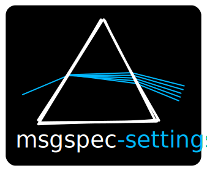

<p align="center">
    
</p>

# msgspec-settings

Typed, multi-source configuration loading on top of `msgspec`.

`msgspec-settings` is for applications that need:
- one typed model for configuration shape
- multiple config inputs (files, `.env`, environment, CLI, custom providers)
- deterministic precedence across all inputs
- strict validation/coercion without writing parsing glue

The core idea is simple: define one `DataModel`, attach ordered `DataSource`s, and instantiate the model.

## Installation

```bash
pip install msgspec-settings
```

```bash
uv add msgspec-settings
```

Tested on `Python>=3.13`

## Quick Start (Layered Config)

`config.toml`:

```toml
host = "toml-host"
port = 7000
[log]
level = "INFO"
```

`.env`:

```dotenv
APP_PORT=7500
APP_LOG_LEVEL=DEBUG
```

```python
from msgspec_settings import (
    CliSource,
    DataModel,
    DotEnvSource,
    EnvironSource,
    TomlSource,
    datasources,
    entry,
    group,
)


class LogConfig(DataModel):
    level: str = "WARN"
    file_path: str = "/var/log/app.log"


@datasources(
    TomlSource(toml_path="config.toml"),
    DotEnvSource(dotenv_path=".env", env_prefix="APP"),
    EnvironSource(env_prefix="APP"),
    CliSource(),
)
class AppConfig(DataModel):
    host: str = entry("127.0.0.1", min_length=1)
    port: int = entry(8080, ge=1, le=65535)
    debug: bool = False
    log: LogConfig = group(collapsed=True)


cfg = AppConfig(port=9000)
print(cfg.model_dump_json(indent=2))
```

Precedence is deterministic and intentional:

```
defaults < source_1 < source_2 < ... < source_n < kwargs
```

With the example above:
- model defaults are the baseline
- `TomlSource` overrides defaults
- `DotEnvSource` overrides TOML
- `EnvironSource` overrides `.env`
- `CliSource` overrides environment values
- constructor kwargs (`AppConfig(port=9000)`) win last

Rationale: this gives safe defaults in code, then progressive override points for deploy/runtime, while still keeping a final explicit override path in Python.

## Field Helpers (`entry` and `group`)

### `entry(...)`

Use `entry(...)` when you need validation metadata and/or safe mutable defaults.

Why it exists:
- attaches `msgspec.Meta(...)` constraints directly from field declaration
- converts mutable defaults (`list`, `dict`, `set`) into factories automatically
- supports extra UI/schema keys: `hidden_if`, `disabled_if`, `parent_group`, `ui_component`

```python
from msgspec_settings import DataModel, entry


class ApiConfig(DataModel):
    timeout_seconds: int = entry(30, ge=1, le=120, description="Request timeout")
    tags: list[str] = entry([], description="Dynamic tags")
```

### `group(...)`

Use `group(...)` for nested object/list/dict fields inferred from annotations.

Why it exists:
- creates safe defaults for nested structures without shared state
- adds optional UI/schema hints (`collapsed`, `mutable`)

```python
from msgspec_settings import DataModel, group


class Child(DataModel):
    value: int = 1


class Parent(DataModel):
    child: Child = group(collapsed=True)
    children: list[Child] = group(mutable=True)
    by_name: dict[str, Child] = group(mutable=True)
```

Notes:
- object annotations used with `group()` must be zero-arg constructible
- `group()` is for object/list/dict-like fields, not primitive scalars

## Built-in Sources (Behavior)

All built-ins are importable from both `msgspec_settings` and `msgspec_settings.sources`.

### `TomlSource` and `YamlSource`

- load mappings from files using `msgspec.toml.decode` / `msgspec.yaml.decode`
- if path is unset or missing, they return `{}` (treated as "source absent")
- parse/read failures raise `RuntimeError` with file context

### `DotEnvSource`

- parses dotenv syntax (`export`, quotes, inline comments)
- optional prefix filtering via `env_prefix`
- nested keys are mapped with `nested_separator` (default `_`)
- with a `model`, values are coerced to field types

Example precedence inside one source:

```dotenv
APP_LOG={"level":"DEBUG"}
APP_LOG_LEVEL=WARN
```

`APP_LOG_LEVEL` overrides `APP_LOG.level`, regardless of line order.

### `EnvironSource`

Same mapping/coercion behavior as `DotEnvSource`, but reads from `os.environ`.

```python
EnvironSource(env_prefix="APP", nested_separator="__")
# APP_LOG__LEVEL=ERROR -> {"log": {"level": "ERROR"}}
```

### `CliSource`

Generates options from model fields (including nested fields).

Key behavior:
- nested fields become flags like `--log-level`
- bools support both positive and negative forms: `--debug` / `--no-debug`
- nested struct fields also accept JSON on the top-level flag:
  - `--log '{"level":"DEBUG"}'`
- explicit nested flags override keys from that JSON
- unknown CLI args are collected in `cli_extra_args` instead of failing
- set `kebab_case=False` to use dotted long flags (e.g. `--log.level`)

```python
src = CliSource(cli_args=["--host", "api", "--unknown-flag"])
data = src.load(model=AppConfig)
print(data)  # {"host": "api"}
print(src.cli_extra_args)  # ["--unknown-flag"]
```

## Custom Source Example

When built-ins are not enough, implement `DataSource.load(...)`.

```python
from typing import Any

from msgspec_settings import DataModel, DataSource, datasources


class SecretsSource(DataSource):
    def load(self, model: type[DataModel] | None = None) -> dict[str, Any]:
        # Replace this with Vault/AWS/GCP/etc.
        return {"host": "secrets-host", "port": 8443}


@datasources(SecretsSource())
class ServiceConfig(DataModel):
    host: str = "localhost"
    port: int = 8080
```

Rationale: sources are deep-cloned per model instantiation, so source-local mutable state does not leak across `DataModel()` calls.

## DataModel Helpers

`DataModel` is a `msgspec.Struct` configured as keyword-only and with dict-like output support.

Useful methods:
- `from_data(data)` to create from a Python mapping
- `from_json(json_str)` to create from JSON bytes/string
- `model_dump()` for Python builtins
- `model_dump_json(indent=...)` for JSON output
- `model_json_schema(indent=...)` for schema export
- `from_datasources(*sources, **kwargs)` to merge source payloads manually

Example:

```python
cfg = AppConfig.from_json('{"host":"example.com","port":8081}')
print(cfg.model_dump())
print(AppConfig.model_json_schema(indent=2))
```

## API Summary

- `DataModel`: typed model base class with validation/serialization helpers
- `DataSource`: source base class (`load(model=...) -> dict[str, Any]`)
- `datasources(*sources)`: decorator that attaches ordered source templates
- `entry(...)`: field helper with validation metadata and safe mutable defaults
- `group(...)`: helper for grouped object/list/dict fields
- built-ins: `TomlSource`, `YamlSource`, `DotEnvSource`, `EnvironSource`, `CliSource`

## Development

Run tests:

```bash
python -m pytest -q
```
